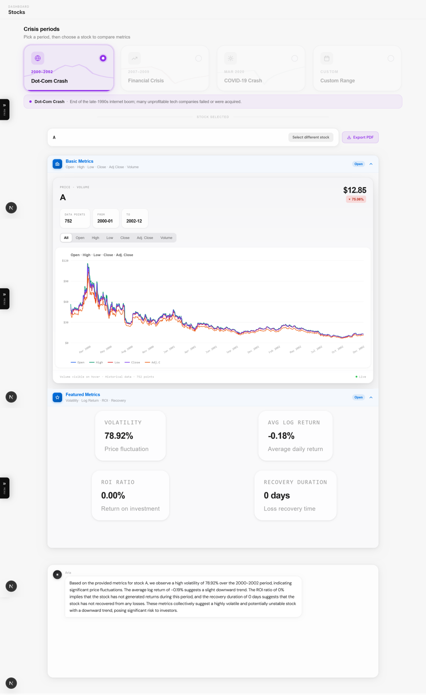
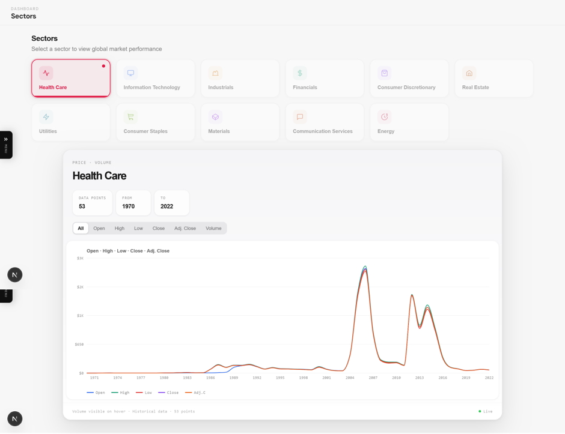
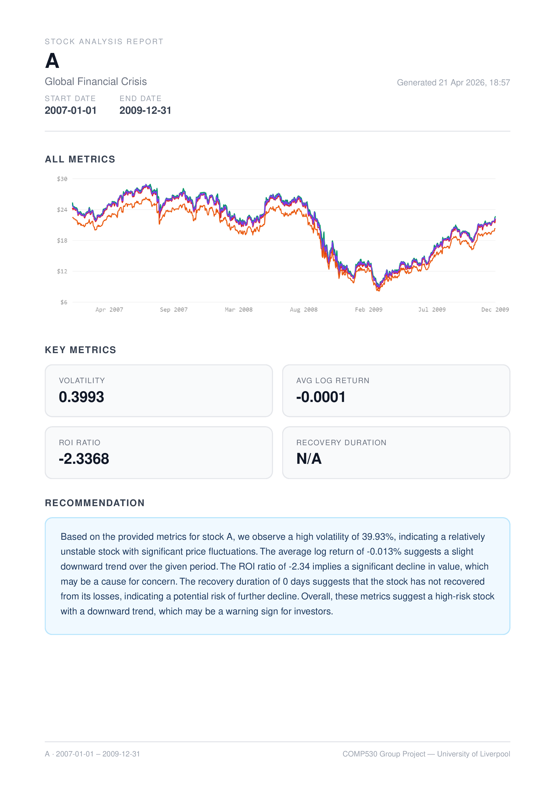
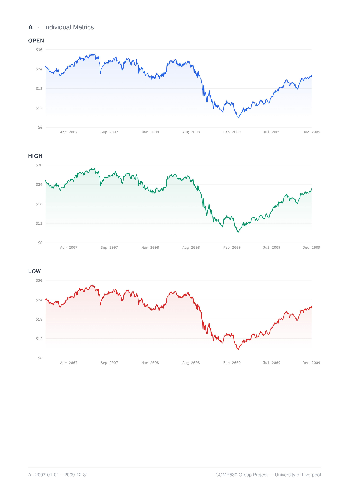
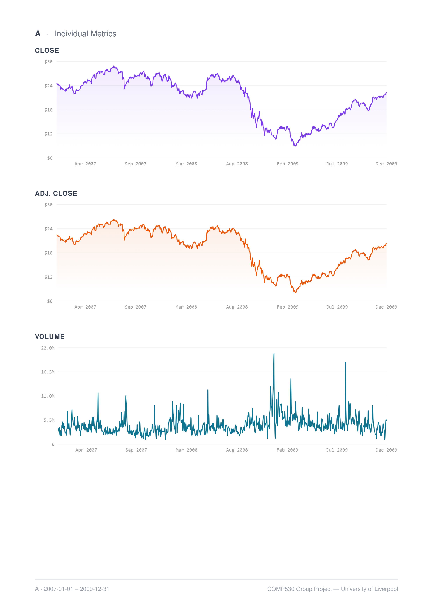

# Stock Analyzer

A full-stack web application for analyzing US equity performance during major historical financial crises. Users select a crisis period (or a custom date range) and a ticker, then view OHLC price charts, computed risk/return metrics, and an LLM-generated narrative summary. A separate sector view aggregates yearly performance across the eleven GICS sectors.

Built as a group project for COMP530 (MSc, University of Liverpool).

## Screenshots

<!-- Add screenshots below. Suggested: dashboard with a crisis selected, the sector view, and the PDF export. -->


### Stocks dashboard


### Sector view


### PDF export



## Features

- **Crisis-period comparison.** Three pre-defined windows (Dot-Com 2000–2002, Financial Crisis 2007–2009, COVID-19 2020–2021) plus a custom date range.
- **Time-series visualization.** Multi-series OHLC line chart with toggleable metrics (Open / High / Low / Close / Adjusted Close / Volume).
- **Computed metrics per request.** Annualized volatility, average daily log return, crisis-vs-pre-crisis ROI ratio, and recovery duration in trading days.
- **LLM-generated insight.** Short natural-language summary of the metrics, served via an OpenAI-compatible endpoint.
- **Sector view.** Yearly aggregated performance for each of the eleven GICS sectors over 1970–2022.
- **PDF export.** Generates a print-ready report of the active chart and metrics via `@react-pdf/renderer`.

## Architecture

```
┌──────────────────────────┐         ┌──────────────────────────┐
│  Next.js 16 / React 19   │  HTTP   │  FastAPI (Python 3.13)   │
│  Recharts · Tailwind     │ ──────► │  pandas · OpenAI client  │
│  Port 3000               │         │  Port 8000               │
└──────────────────────────┘         └────────────┬─────────────┘
                                                  │
                                                  ▼
                                        ┌──────────────────────┐
                                        │  CSV files on disk   │
                                        │  backend/data/*.csv  │
                                        └──────────────────────┘
```

The backend serves three endpoints from local CSVs (one file per ticker) and calls a configured LLM endpoint for the recommendation text. The frontend is a Next.js app router project with a dashboard panel for per-stock analysis and a separate sector view.

## Tech Stack

**Backend**
- FastAPI · Uvicorn
- pandas · NumPy
- `openai` Python client (configured against any OpenAI-compatible endpoint — Groq by default)
- `uv` for dependency management

**Frontend**
- Next.js 16 (App Router) · React 19 · TypeScript
- Recharts (charts) · Tailwind CSS · Radix UI primitives · shadcn-style components
- `@react-pdf/renderer` (PDF export) · Framer Motion (animations) · Axios

## Project Structure

```
group-project/
├── backend/
│   ├── app/
│   │   ├── main.py                       # FastAPI app + CORS
│   │   ├── api/
│   │   │   ├── router.py
│   │   │   ├── endpoints/csv_files.py    # /api/csv-files, /api/per-year, /api/stockreq
│   │   │   ├── classes/Stock.py          # StockRequest pydantic model
│   │   │   └── utility/
│   │   │       ├── raw_data_extraction.py
│   │   │       ├── metric_computation.py # volatility, ROI, recovery
│   │   │       ├── llm_recomendation.py
│   │   │       ├── sector_yearly_average.py
│   │   │       └── yearly_data_average.py
│   ├── data/                             # Per-ticker OHLCV CSVs (not in repo)
│   ├── processed_data/                   # Aggregated sector/yearly JSON
│   ├── pyproject.toml · uv.lock
│   ├── run.py · Dockerfile
│   └── README.md
├── frontend/
│   ├── app/                              # Next.js App Router pages
│   │   ├── page.tsx                      # Stocks dashboard
│   │   └── sector/page.tsx               # Sector view
│   ├── components/
│   │   ├── dashboard/StockCharts.tsx     # Main chart component
│   │   ├── dashboard/pdf/                # PDF export
│   │   └── ui/                           # Shared UI primitives
│   ├── lib/                              # API client, types, helpers
│   ├── hooks/
│   ├── public/
│   ├── package.json · tsconfig.json
│   └── Dockerfile
├── data_cleaning.ipynb                   # Notebook used to produce backend/data
├── docker-compose.yaml
└── README.md
```

## Prerequisites

- **Docker Desktop** (recommended path — single command to bring everything up), OR
- **Manual setup**: Python ≥ 3.13, [uv](https://docs.astral.sh/uv/), Node.js ≥ 20, npm
- An API key for an OpenAI-compatible LLM endpoint (the project uses [Groq](https://groq.com/) by default — free tier works)
- Per-ticker CSV files placed under `backend/data/` (these are excluded from the repo; see [Data](#data))

## Setup

### Option 1 — Docker (recommended)

1. Place the per-ticker CSV files in `backend/data/` (one file per ticker, e.g. `GOOG.csv`, `AAPL.csv`).
2. Create `backend/app/.env` (see [Environment variables](#environment-variables)).
3. Bring the stack up:
   ```bash
   docker compose up --build
   ```
4. Open the frontend at <http://localhost:3000>. The backend is exposed at <http://localhost:8000>.

### Option 2 — Manual

**Backend:**
```bash
cd backend
uv sync
uv run dev
# → serves on http://localhost:8000
```

**Frontend** (in a second terminal):
```bash
cd frontend
npm install
npm run dev
# → serves on http://localhost:3000
```

## Environment Variables

Create `backend/app/.env` with the following keys:

| Key | Description | Example |
|---|---|---|
| `LLM_API_KEY` | API key for an OpenAI-compatible chat-completions endpoint | `gsk_...` (Groq) |
| `URL` | Base URL of the LLM endpoint | `https://api.groq.com/openai/v1` |
| `MODEL_NAME` | Model identifier accepted by the endpoint | `llama-3.1-8b-instant` |

The frontend reads `NEXT_PUBLIC_API_URL` (set by `docker-compose.yaml` to `http://backend:8000`). When running manually, the frontend defaults to `http://localhost:8000` — see [frontend/lib/axios.ts](frontend/lib/axios.ts).

## API Endpoints

| Method | Path | Description |
|---|---|---|
| `GET` | `/api/csv-files` | List available tickers (file stems from `backend/data/`) |
| `GET` | `/api/per-year` | Return precomputed sector yearly averages |
| `POST` | `/api/stockreq` | Return OHLCV series, computed metrics, and LLM recommendation for a ticker over a date range |

`POST /api/stockreq` request body:
```json
{
  "stock_name": "GOOG",
  "start_date": "2007-01-01",
  "end_date":   "2009-12-31"
}
```

Response shape (abbreviated):
```json
{
  "data": [{ "Date": "2007-01-03", "Open": 11.49, "High": 11.79, "Low": 11.42, "Close": 11.76, "Volume": 12345600, "Adjusted Close": 11.76 }, ...],
  "metrics": { "volatility": 0.3886, "avg_log_return": 0.0004, "roi_ratio": 5.62, "recovery_duration": 218 },
  "recommendation": "Based on the provided metrics for GOOG..."
}
```

## Metrics

All metrics are computed in [backend/app/api/utility/metric_computation.py](backend/app/api/utility/metric_computation.py).

- **Volatility** — annualized standard deviation of daily log returns: `std(log(Close_t / Close_{t-1})) * sqrt(252)`.
- **Avg log return** — mean daily log return over the window.
- **ROI ratio** — `r_crisis / r_pre_crisis`, where each `r` is `(Close_last − Close_first) / Close_first` over the window. The "pre-crisis" window is the year immediately before `start_date`. Returns `0` if pre-crisis data is missing or its return is zero.
- **Recovery duration** — trading days from the within-window minimum Close back to the pre-crisis peak Close. Returns `0` if no recovery occurred within the window.

## Data

- The per-ticker CSV files live in `backend/data/` (one file per ticker, named `{TICKER}.csv`). These files are **not** committed to the repo due to size — they were produced by [data_cleaning.ipynb](data_cleaning.ipynb) from raw S&P 500 / NASDAQ / NYSE / Forbes 2000 daily history.
- Aggregated outputs in `backend/processed_data/` (sector yearly averages, ticker details) **are** committed and are read directly by the API.
- Each ticker CSV is expected to have columns: `Date, Open, High, Low, Close, Volume, Adjusted Close`.

## Scripts

**Backend:**
- `uv run dev` — start the dev server (uvicorn with reload)

**Frontend:**
- `npm run dev` — Next.js dev server with hot reload
- `npm run build` — production build
- `npm start` — serve the production build
- `npm run lint` — run ESLint

## Notes & Known Limitations

- **US equities only.** Coverage is limited to tickers from the S&P 500, NASDAQ, NYSE, and Forbes 2000 universes and to daily granularity.
- **No live data ingestion.** Historical CSVs are pre-generated; the backend does not fetch from a live market data API.
- **No authentication or rate limiting.** Endpoints are open and CORS is permissive — fine for local development, not suitable for public deployment as-is.
- **No automated tests yet.** Metric functions in `metric_computation.py` are pure and would be a good place to start.
- **Frontend API base URL** is currently hard-coded for the manual-setup path; switch to `process.env.NEXT_PUBLIC_API_URL` before any non-local deployment.
- **`backend/app/.env` should not be committed.** If a key was accidentally pushed, rotate it.
